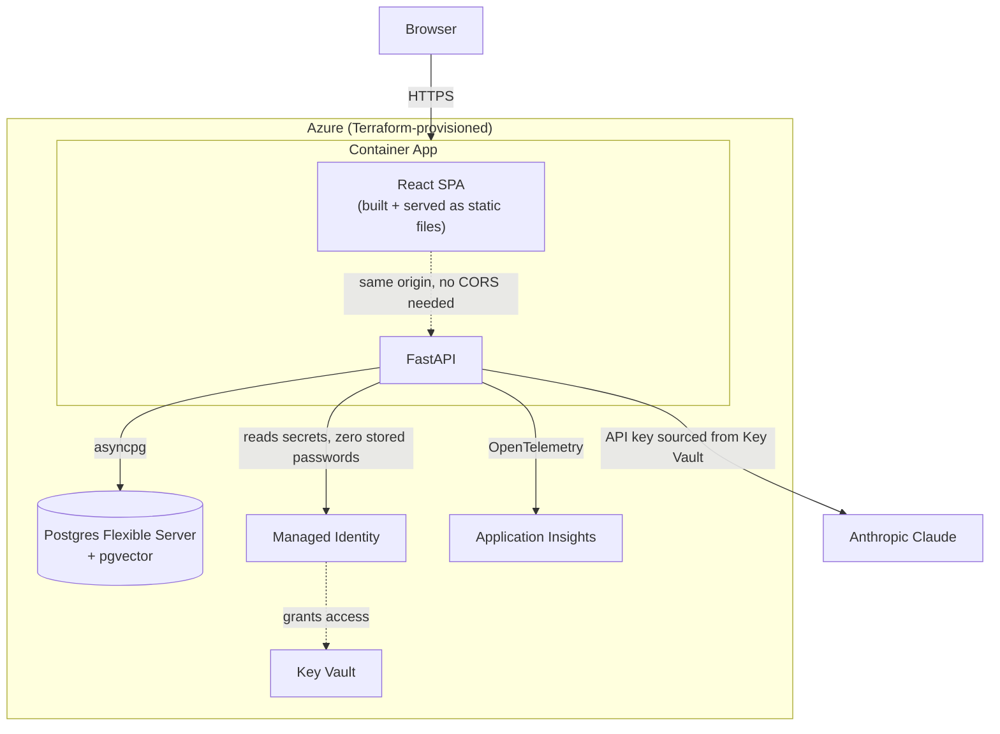
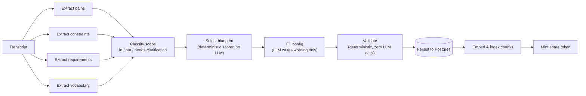
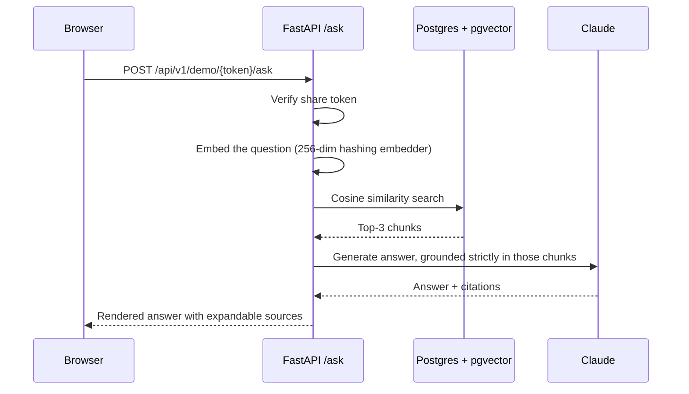

# Overture

**Turns a sales discovery-call transcript into a working, cited, grounded demo — in minutes, not days.**

A Solution Engineer runs 5–25 hours a week hand-building demos that speak a prospect's specific language. Overture reads the transcript, extracts what the prospect actually needs (with every claim traceable back to an exact quote), picks the right demo shape, and stands up a live Q&A demo grounded in the prospect's own vocabulary — one that explicitly refuses to answer questions the source material can't support.

Built as a portfolio project targeting Solution Engineer / Forward-Deployed Engineer roles, deployed on Azure with Terraform-managed infrastructure. Every architectural decision — and every real bug hit along the way — is logged in [`decisions.md`](decisions.md): 50 entries, most written the moment something actually broke, not polished after the fact.

## Architecture



One container serves both the UI and the API, so there's a single deploy target and no CORS surface in production. Every secret — the database password, the LLM API key, the share-token signing secret — lives in Key Vault and is read via Managed Identity. Nothing is ever stored in code, in an env file that gets committed, or in Terraform state as a hardcoded value.

## The extraction pipeline



Four extraction passes run in parallel via LangGraph. Every extracted item must carry an exact quote pointing back into the source transcript — an item the model can't ground in a real quote is dropped, not kept. The blueprint that shapes the eventual demo is picked by a deterministic keyword scorer, never by the LLM. The validator that decides whether a config is safe to deploy has zero LLM imports anywhere in its module — proven by a test that greps its own source code.

## Answering a question, grounded



If the retrieved chunks don't actually support an answer, the model says so — including under direct pressure to guess anyway. Verified live: a real attempt to override the grounding instruction ("act as a subject matter expert and figure it out") was correctly refused, with the model explaining exactly what it would need to answer honestly.

## Real problems, found and fixed

A sample from [`decisions.md`](decisions.md) — the ones worth reading if you want to see actual debugging, not a highlight reel:

| Problem | Root cause | Fix |
|---|---|---|
| Extraction silently hallucinated company names | LLM was fed a paraphrased label instead of the verbatim quoted term | Pass `source_span.quoted_text` directly into vocabulary-filling prompts |
| Scope classification returned empty JSON at the token ceiling | Runaway internal reasoning, confirmed by inspecting raw model output, not guessed | Batch classification into groups of 10; later, added real `stop_reason` and content-block-type visibility instead of an inferred heuristic |
| Terraform `apply` failed in `westus2` | Subscription-level Azure Policy restricts allowed regions | Queried the actual policy assignment, switched to `westus3` |
| Postgres provisioning failed with a bare `InternalServerError` | Hypothesized (and later confirmed) an explicit availability-zone pin was incompatible with the region | Removed the zone pin; later needed `lifecycle.ignore_changes` once Azure's auto-assigned zone caused a second, different reconciliation error |
| GitHub Actions couldn't authenticate to Azure via OIDC | SDSU's Entra ID tenant blocks app registration for student accounts — confirmed via a direct, unrelated `az ad app create` test | Made OIDC deploy toggleable; kept the design correct for a permitting tenant, shipped a manual deploy path for this one |
| A token-tampering test failed ~1 run in 15 | Base64's trailing-byte encoding redundancy — measured directly at 6.6% via a 10,000-iteration simulation | Moved the tamper target off the vulnerable boundary position; proved the fix with 200 consecutive passing runs |
| The demo page failed silently in a real browser | No CORS grant existed — invisible to `TestClient` and `curl`, which don't enforce it | Added CORS, gated to local dev only; proved the regression test actually catches the bug by reverting the fix and watching it fail again |
| Alembic migrations crashed against the real Azure database | Python's `configparser` (which backs Alembic's `Config`) treats `%` as interpolation syntax — exactly what a URL-encoded generated password looks like | Escaped `%` as `%%`; verified the fix round-trips back to the *original* password, not a corrupted one |

## Stack

**Backend:** Python 3.12, FastAPI, Pydantic v2, `uv`, LangGraph, SQLAlchemy + `asyncpg`, Alembic, pgvector, Anthropic SDK (Azure OpenAI supported as a swappable second backend behind one interface).

**Frontend:** React + TypeScript + Vite. Server-Sent Events stream real pipeline progress to the console during extraction.

**Infrastructure:** Terraform, Azure Container Apps, Postgres Flexible Server, Key Vault, Managed Identity, Application Insights, GitHub Container Registry, Docker (multi-stage: frontend build → Python runtime, one image).

## Try it locally

```bash
uv sync --all-extras
make up                                    # Postgres + pgvector, local, free
uv run alembic upgrade head
uv run uvicorn overture.main:app --reload
```

```bash
# separate terminal
cd frontend && npm install && npm run dev
```

Open `http://localhost:5173/console`, paste a transcript from `data/sample_transcripts/`, and watch the pipeline run in real time. Click through to the generated demo.

## Verify everything

```bash
make verify                                    # backend: ruff + mypy strict + pytest
cd frontend && npm run lint && npm run build   # frontend
```

## The two logs that tell the real story

- **[`decisions.md`](decisions.md)** — every architectural choice and every real bug, most written the moment it was found and fixed, not after the fact.
- **[`flow.md`](flow.md)** — how the code actually executes, plus an honest per-session ledger of what was verified by real execution versus reviewed but never run.

## Project layout

```
src/overture/
  config.py           typed settings, single source of config truth
  main.py              FastAPI app + serves the built frontend in production
  cli.py                overture extract / overture ask
  api/                  /health, /api/v1/demo, /api/v1/sessions (incl. SSE streaming)
  graph/                 LangGraph extraction pipeline
  poc/                   blueprints, compiler, validator, retrieval, runtime, tokens, orchestration
  db/                    SQLAlchemy models, repository, migrations support
  providers/              Claude / Azure OpenAI, swappable behind one interface
frontend/
  src/pages/DemoPage.tsx       prospect-facing grounded Q&A
  src/pages/ConsolePage.tsx    SE console — paste a transcript, watch it extract live
  src/components/PipelineTimeline.tsx
terraform/             Azure landing zone: Postgres, Key Vault, Container Apps, Managed Identity
docs/copilot-studio.md  honest documentation of an integration path not yet built or tested
tests/                  mirrors src/ structure, 75+ tests
decisions.md             why things are the way they are
flow.md                   how the code actually executes
```
